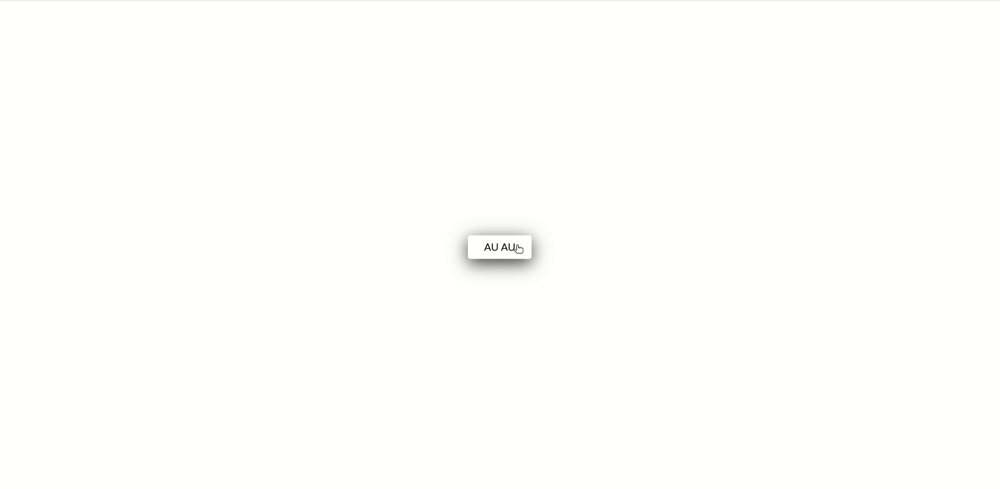

<h1>Dogs</h1>

O projeto está no ar nesse link: <a href="https://brunoferreiraa123.github.io/dog-api/"> Dogs</a>, acesse e conheça diversas raças de caninas :grin:

<h2>:grey_exclamation: Sobre</h2>

App para conhecer diversas raças de cães :dog:

Quer que seu Dog apareca aqui? <a href="https://github.com/jigsawpieces/dog-api-images#dog-api-images">saiba como</a>

<h2>:hammer: Ferramentas</h2>

Esse projeto utiliza a API DOG: <a href="https://dog.ceo/dog-api/">APIDog</a>

Projeto construído com <a href="http://vanilla-js.com/">VanillaJS.</a>

<h2></h2>
Desenvolvido por por Bruno | <a href="https://www.linkedin.com/in/brunoo-ferreiraa/">Linkedin</a>
